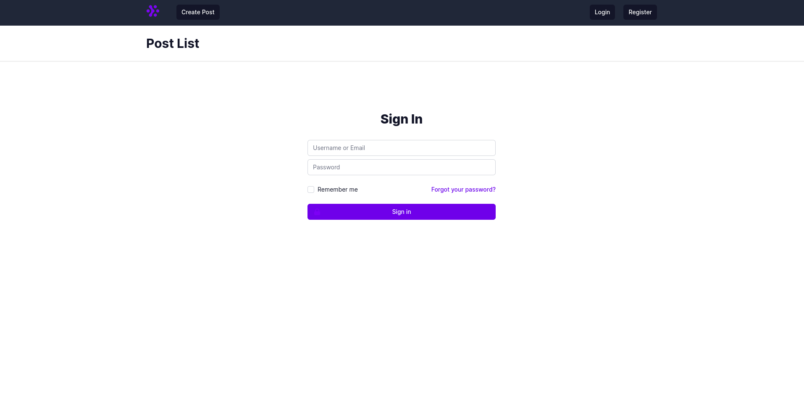
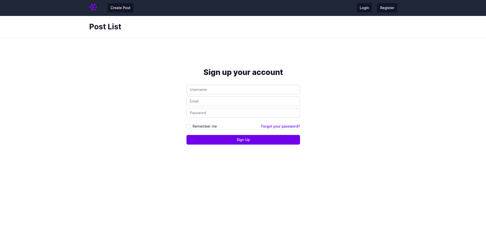
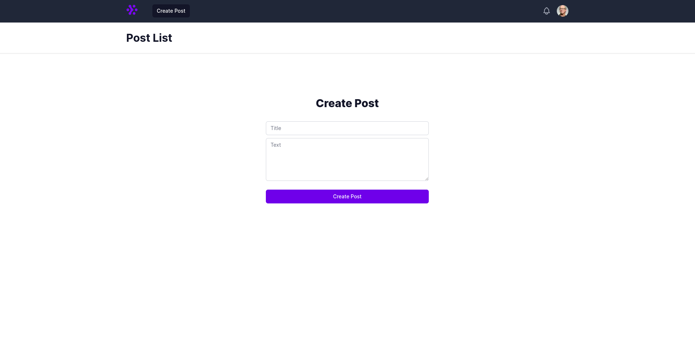

This project is a tutorial for who want to learn Next.js, Apollo-GraphQL using Typescript






## Features

- Login/Register/ForgotPassword/ChangePassword
- Server side rendering.
- Updating, Reading or Merging any normalized objects in apollo cache
- Pagination with infinity scrolling to get more blog posts

## Setup

Please note: this project use the pnpm package manager. To install it, run:

```bash
npm install -g pnpm
```

Install dependencies:

```bash
pnpm i
```

Start the dev server:

```bash
pnpm dev
```

Open [http://localhost:3000](http://localhost:3000) with your browser to see the result.

## Development

If you want to change or add new Graph query or mutation, write the file with `.graphql` extension.
And then

```bash
pnpm gen
```

**Please note:** This project reley on a graphql-server.
You can install the server on your local from the my another repository, and fix them to better suit your cases.
[Apollo-Express-GraphQL-Server](https://github.com/pyDjangoDev/apollo-express-typeorm-blog)
